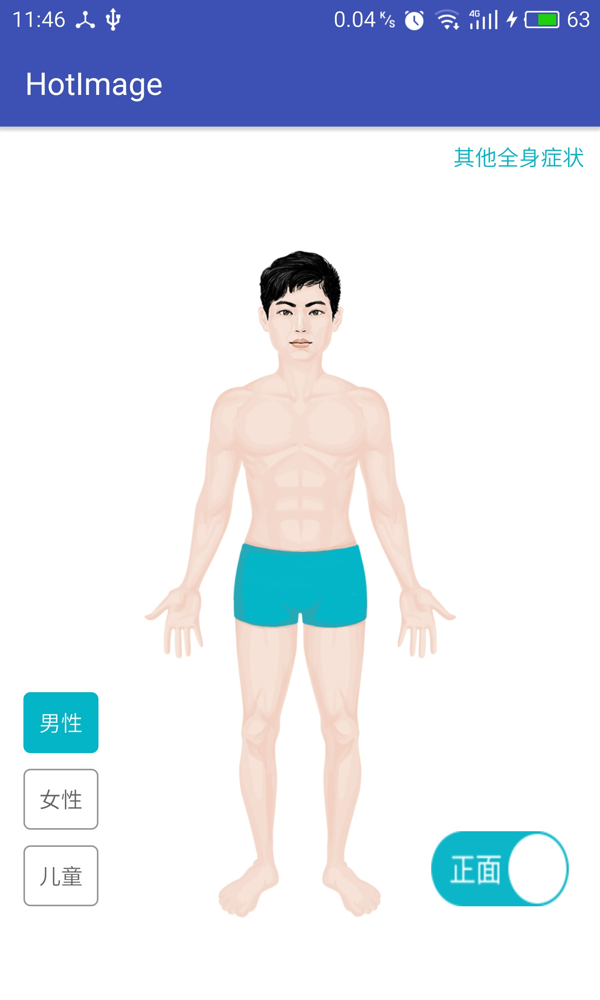
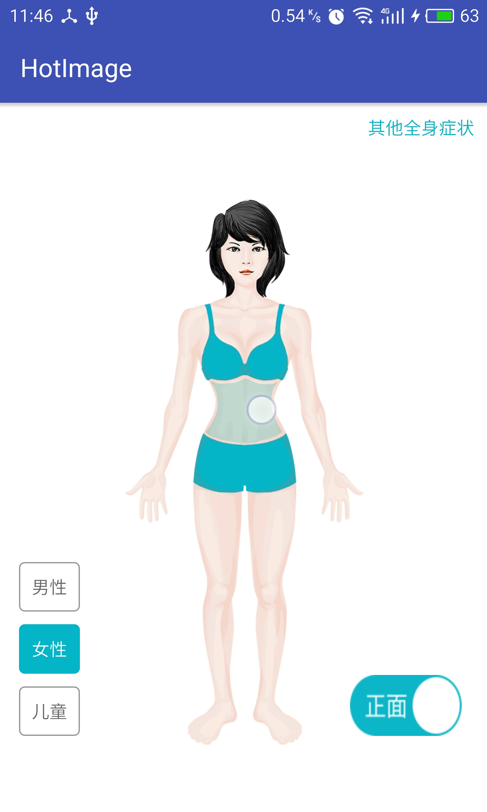

# HotImage
人体部位不规则区域点击

# HotImage是基于对一张图片进行不规则区域点击响应不同事件。  

  

＃注  
将图片中每个点击区域的像素坐标点配置assets文件下的xml中，主要是使用DreamWeaver描出边缘并导出坐标点，这里的重点在于每一个部位图与人体原图是标准对应的，否则坐标不准确；以后打算换成SVG，但是SVG因为向下兼容问题，短期不考虑;代码注释很清晰，欢迎学习交流。
